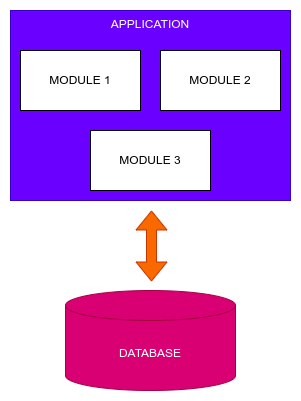
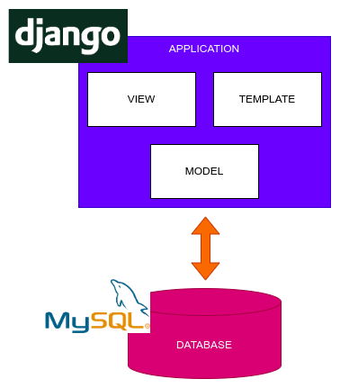
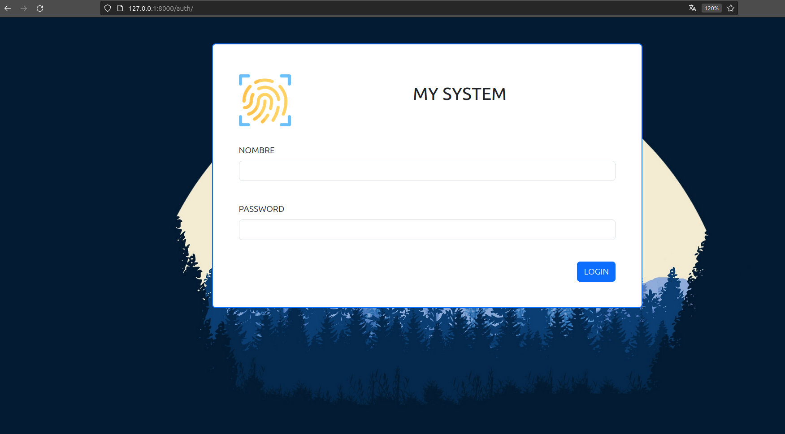
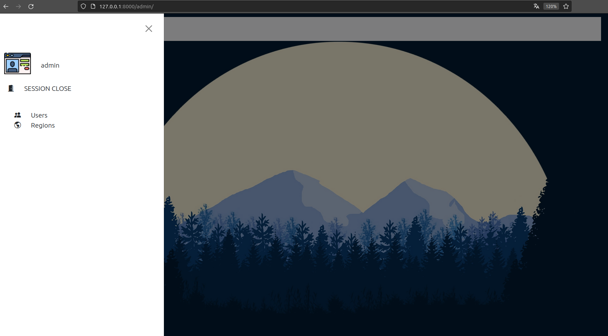

## SOFTWARE ARCHITECTURE PATTERNS - Patrones de Arquitectura de Software.

El siguiente proyecto tiene el objetivo de explicar mediante docker algunos patrones arquitectónicos. Para ello es requisito tener instalado docker dentro de sus sistema para poder ejecutar los distintos proyectos.

# Monolithic Architecture - Arquitectura Monolítica.

Una arquitectura monolítica puede constar de un solo archivos, multiples archivos, librerías o módulos los cuales al ser compilados o ejecutados generán un único archivo o aplicación para ser desplegado dentro de una máquina o servidor. En la siguiente imagen se puede visualizar un ejemplo.



## Sample Monolithic Architecture Django - Ejemplo Arquitectura Monolítica con Django 

En este ejemplo se utilizará una arquitectura monolítica basada en Django un framework de python para la creación de aplicaciones web. Este usa un patrón Modelo Vista Plantilla (MVT).

Por otra parte el motor se desplegará en un contenedor distinto al de la aplicación. Esto lo podemos observar en el siguiente diagrama.



Para desplegar la aplicación deberemos ejecutar el siguiente comando:

**WINDOWS CON CMD**

```shell
.\monolithic_architecture\django\deploy.bat
```

**TERMINAL LINUX**

```shell
sh monolithic_architecture/django/deploy.sh
```


Para poder iniciar sesión deberemos ingresar a [http://127.0.0.1:9000](http://127.0.0.1:9000) o [http://localhost:9000](http://localhost:9000).

Para ingresar al sistema deberemos realizarlo con las siguientes credenciales.

```
user: admin
pass: admin
```





