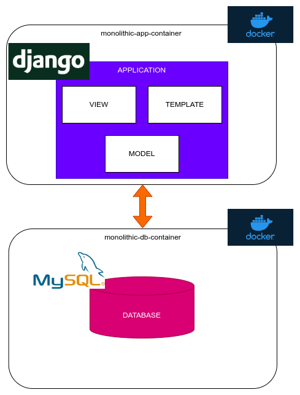

## CONTENT

[1. SOFTWARE ARCHITECTURE PATTERNS - Patrones de Arquitectura de Software.](#software-architecture-patterns)

[1.1 Client Server Architecture - Arquitectura Cliente Servidor.](#client-server-architecture)

[1.2 Monolithic Architecture - Arquitectura Monolítica.](#monolithic-architecture)


<a name="software-architecture-patterns"></a>
# SOFTWARE ARCHITECTURE PATTERNS - Patrones de Arquitectura de Software.

El siguiente proyecto tiene el objetivo de explicar mediante docker algunos patrones arquitectónicos. Para ello es requisito tener instalado docker dentro de sus sistema para poder ejecutar los distintos proyectos.

<a name="client-server-architecture"></a>
#  Client Server Architecture - Arquitectura Cliente Servidor.

Esta arquitectura se basa principalmente en el envió de mensajes por parte del cliente hacia el servidor, el cual realizará las acciones correspondientes a su lógica de implementación. En la siguiente imagen podemos ver su representación.


## Sample Client Server Architecture - Ejemplo Arquitectura Cliente Servidor

En este ejemplo se utilizará una arquitectura basada en cliente servidor mediante python y la generación de socket TCP/IP los cuales permitirán establecer conexión y el envió de mensajes.


Para desplegar la aplicación deberemos ejecutar el siguiente comando:

**WINDOWS CON CMD**

```shell
.\client_server\python\deploy.bat
```

**TERMINAL LINUX**

```shell
sh client_server/python/deploy.sh
```

El servidor generará un stream TCP/IP el que escuchara por el puerto 11000 los mensajes del cliente. Por parte del cliente este se conectará 20 segundos después de que el servidor aperturo el canal de comunicación y comenzará a enviar mensajes cada 5 segundos. Esto lo podemos ver en las siguientes imagenes.


<a name="monolithic-architecture"></a>
# Monolithic Architecture - Arquitectura Monolítica.

Una arquitectura monolítica puede constar de un solo archivos, multiples archivos, librerías o módulos los cuales al ser compilados o ejecutados generán un único archivo o aplicación para ser desplegado dentro de una máquina o servidor. En la siguiente imagen se puede visualizar un ejemplo.


## Sample Monolithic Architecture Django - Ejemplo Arquitectura Monolítica con Django 

En este ejemplo se utilizará una arquitectura monolítica basada en Django un framework de python para la creación de aplicaciones web. Este usa un patrón Modelo Vista Plantilla (MVT).

Por otra parte el motor se desplegará en un contenedor distinto al de la aplicación. Esto lo podemos observar en el siguiente diagrama.



Para desplegar la aplicación deberemos ejecutar el siguiente comando:

**WINDOWS CON CMD**

```shell
.\monolithic_architecture\django\deploy.bat
```

**TERMINAL LINUX**

```shell
sh monolithic_architecture/django/deploy.sh
```


Para poder iniciar sesión deberemos ingresar a [http://127.0.0.1:9000](http://127.0.0.1:9000) o [http://localhost:9000](http://localhost:9000).

Para ingresar al sistema deberemos realizarlo con las siguientes credenciales.

```
user: admin
pass: admin
```


## Sample Monolithic Architecture Django with Load Balancer - Ejemplo Arquitectura Monolítica con Django y Balanceador de Carga

En este ejemplo se utilizará una arquitectura monolítica basada en Django un framework de python para la creación de aplicaciones web junto a un balanceador de carga configurado con nginx y la estrategía ip hash.

Por otra parte el motor se desplegará en un contenedor distinto al de las aplicaciones. Esto lo podemos observar en el siguiente diagrama.


Para desplegar la aplicación deberemos ejecutar el siguiente comando:

**WINDOWS CON CMD**

```shell
.\monolithic_architecture_with_loadbalancer\django\deploy.bat
```

**TERMINAL LINUX**

```shell
sh monolithic_architecture_with_loadbalancer/django/deploy.sh
```

